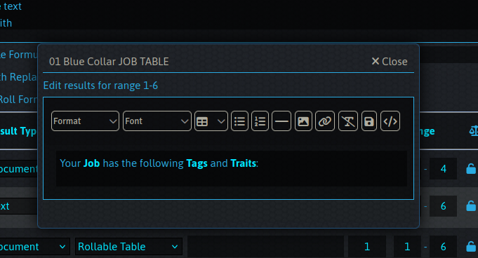

# Format RollTable Text
Adds a button to roll table results which lets you edit text results in a nice editor, the same type as the roll table description uses.

The text in the regular configuration view will include the html tags when the popup is closed.

# Development
`npm i -D "${FOUNDRY_PATH}/resources/app`

# Changelog
## 0.0.10
* Fix bug that was putting the button in the wrong row
* Allow window resizing

## 0.0.5
Change html button to the default edit button

# License
MIT License. Do what you will. PRs welcome. 
